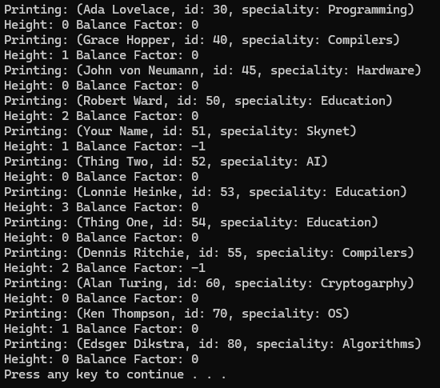

# CS 233 Datat Strucutres & Algorithms

Self-balancing binary search tree that maintains height difference of less than one between sub trees. 

## Assignment Info
Create an AVL Tree. You only need to complete printTree, and insert.  Of course to get insert working, you will need to create some private member functions for example: balance, rotatingRight, and rotatingLeft. 

Note:  Your printTree function should also output the height and balance factor for each node.

For turn in,  include you .h file and the output from the program.   If you made changes to the main, then also include it as well.    

You only need to run it for the 12 or so inserts that were done in main.   You don't need to use any of the files inputs for the turn in.
Document any problems that you were not able to solve.

## Output Example
  
